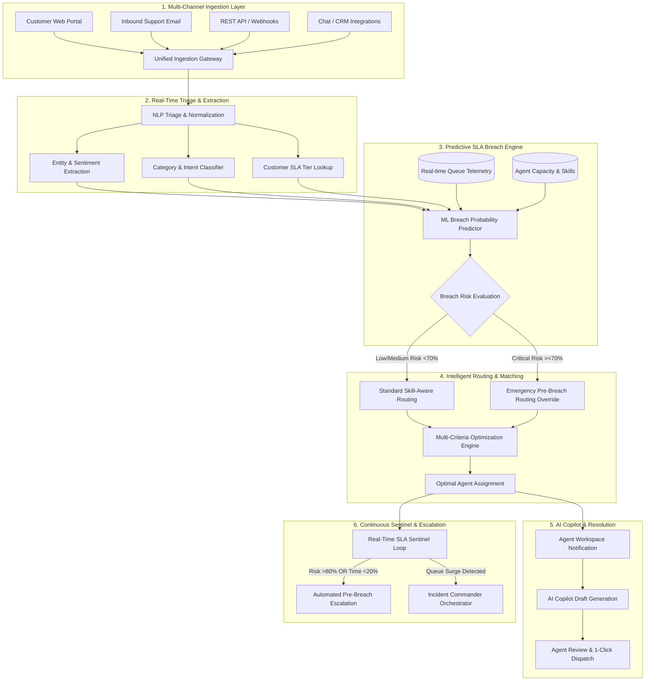
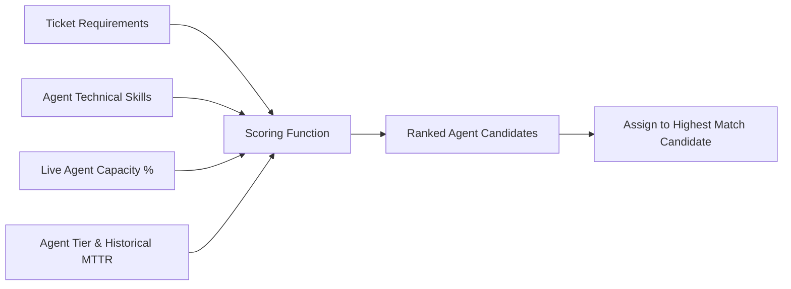
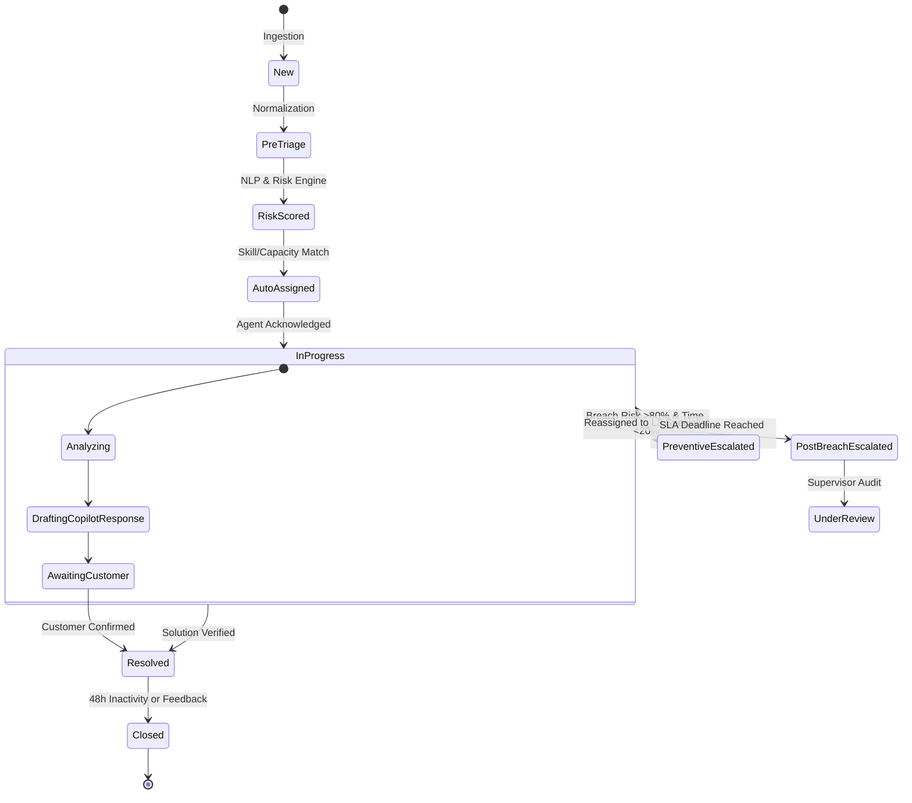
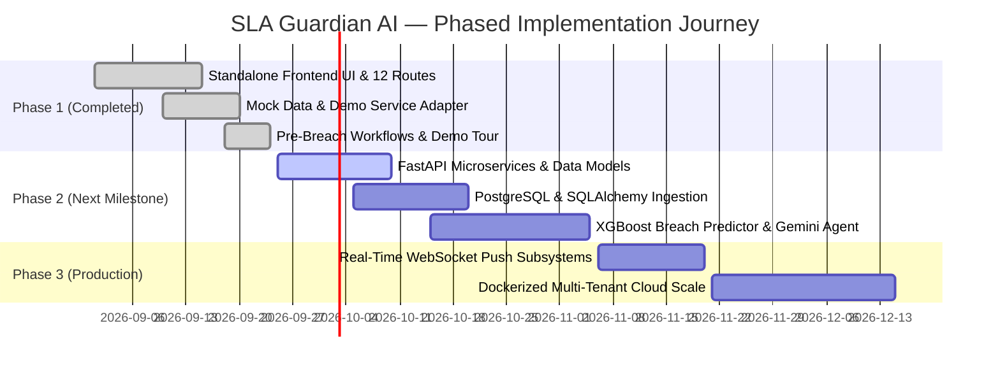

# SLA Guardian AI — Complete Full System Workflow Report
**Problem Statement**: HTH-SA-10 — SLA-Aware Automated Support Ticket Routing & Escalation System  
**System Motto**: *"Predict. Prevent. Optimize. Resolve."*  
**Document Version**: 1.0.0 (Comprehensive Architecture & Lifecycle Specification)

---

## 1. Executive Architectural Blueprint

SLA Guardian AI redefines enterprise customer support operations by introducing **Predictive SLA Breach Prevention**. Rather than alerting supervisors after a service level agreement (SLA) deadline is violated, the system continuously analyzes streaming telemetry, operational queues, and sentiment to forecast failure likelihood and execute automated, preventative interventions before breaches materialize.



---

## 2. End-to-End System Workflow Lifecycle

The end-to-end lifecycle consists of seven tightly synchronized operational stages:

### Stage 1: Ingestion & Normalization
1. **Payload Intake**: Ingestion gateways receive structured (REST, CRM webhooks) and unstructured (email body, portal tickets) payloads.
2. **Sanitization & Normalization**: Strips malicious script tags, standardizes timestamps to ISO-8601 UTC, and maps customer IDs against enterprise account tiers (Enterprise Platinum, Enterprise Gold, Business, Standard).
3. **Canonical Ticket Generation**: Emits an immutable `TicketCreatedEvent` containing initial priority, timestamps, raw customer statements, and SLA target windows derived from contractual policies.

### Stage 2: Cognitive Triage & Feature Extraction
1. **NLP Classification**: Analyzes ticket content to categorize technical domain:
   - `Billing & Payments` (payment gateway timeouts, double charges, invoices)
   - `Technical Support` (API timeouts, SDK bugs, stack traces)
   - `Platform / Infrastructure` (service degradation, latency spikes)
   - `Security & Compliance` (auth tokens, access controls, vulnerability audits)
   - `Customer Success` (feature enablement, onboarding, license provisioning)
2. **Sentiment & Urgency Scoring**: Assesses customer emotional temperature (-1.0 to +1.0) and urgency index (Low, Medium, High, Critical) based on keyword patterns, recurring failures, and revenue risk.

### Stage 3: Predictive SLA Breach Probability Engine
Unlike legacy timers that simply subtract elapsed time from a fixed deadline, SLA Guardian AI calculates an instantaneous **Breach Probability ($P_{\text{breach}}$)** continuously updated across the ticket's active lifecycle:

$$P_{\text{breach}} = \sigma\left(w_1 \cdot \frac{T_{\text{elapsed}}}{T_{\text{SLA}}} + w_2 \cdot \frac{\text{QueueDepth}_{\text{dept}}}{\text{Capacity}_{\text{dept}}} + w_3 \cdot \frac{\text{MTTR}_{\text{category}}}{T_{\text{remaining}}} + w_4 \cdot \text{Complexity} + w_5 \cdot (1 - \text{Sentiment})\right)$$

- **Risk Levels**:
  - `CRITICAL` ($P_{\text{breach}} \ge 70\%$ or $T_{\text{remaining}} \le 25\%$): Triggers proactive pre-breach alerts.
  - `HIGH` ($50\% \le P_{\text{breach}} < 70\%$): Triggers queue prioritization and supervisor watch.
  - `MEDIUM` ($30\% \le P_{\text{breach}} < 50\%$): Standard monitoring with automated progress reminders.
  - `LOW` ($P_{\text{breach}} < 30\%$): Normal operational processing.

### Stage 4: Skill-Based & Capacity-Aware Routing Engine
The routing engine applies a multi-factor optimization algorithm to select the single best agent from the organizational roster:



- **Candidate Filtering**:
  - Eliminates agents currently in `Offline` or `On Break` status.
  - Excludes agents at $100\%$ capacity ($ActiveTickets = MaxCapacity$).
  - Filters for required technical competencies (e.g. `Payment Gateways`, `Stripe API`, `OAuth 2.0`).
- **Optimization Score**:
  $$\text{Score}_i = 0.40 \cdot \text{SkillMatch}_i + 0.35 \cdot (1 - \text{LoadRatio}_i) + 0.15 \cdot \text{HistoricalSLA}_i + 0.10 \cdot \text{TierBonus}_i$$
- **Explainability**: Every assignment produces an explicit `RoutingDecision` log specifying why the selected agent was chosen and why adjacent agents were rejected.

### Stage 5: Pre-Breach Preventive Escalation Protocol
The platform strictly bifurcates escalations into two operational regimes:

| Dimension | Preventive Escalation (Pre-Breach) | Post-Breach Escalation (Reactive) |
| :--- | :--- | :--- |
| **Trigger Timing** | **BEFORE deadline** ($P_{\text{breach}} > 75\%$ or $<25\%$ time left) | **AFTER deadline** (Elapsed time > SLA target) |
| **Operational Goal** | **Prevent failure**, protect customer relationship & ARR | Damage control, RCA, customer apology, penalty audit |
| **System Action** | Instant re-route to L3 specialist, queue jump, copilot draft | Supervisor notification, incident log, post-mortem flag |
| **Impact on SLA Metric** | Counts as **SLA Compliant** upon timely resolution | Counts as **SLA Violation** against team performance |

#### Escalation Levels:
- **L1 Support**: Standard triage and first-response execution.
- **L2 Senior Engineer**: Deep technical debugging and database query verification.
- **L3 Specialist (e.g. Priya Sharma)**: High-urgency financial/architectural interventions.
- **L4 Operations Director / VP**: Systemic crisis handling and cross-departmental escalations.

### Stage 6: Incident Command & Queue Deflection
When the system detects a statistically significant anomaly in ticket intake (e.g., $+200\%$ volume in `Billing` within 10 minutes):
1. **Cluster Identification**: Groups incoming tickets under a unified Incident record (e.g. `INC-2026-081: Payment Gateway Webhook Timeout Surge`).
2. **Deflection Playbook**:
   - Enables dynamic portal notification banners informing customers of known upstream issues.
   - Generates AI auto-responses answering standard queries, reducing queue load by up to $35\%$.
3. **Dynamic SLA Safeguard**: Proposes temporary, approved SLA target extensions for non-critical tickets to prevent artificial fleet-wide breach cascade.
4. **Interactive Command Center**: Provides support commanders with 1-click approvals for emergency re-allocations and status blasts.

### Stage 7: Digital Twin & Continuous Optimization
The **Digital Twin** maintains a live simulated model of the entire enterprise support apparatus:
- **Baseline State**: Current active tickets, live agent loads, queue backlogs.
- **Simulated Future State**: Projects queue congestion and projected breaches 4h, 8h, and 12h into the future based on current arrival rates and MTTR.
- **AI-Optimized State**: Automatically generates optimal workload re-balancing actions, showing predicted SLA compliance recovery from $64.2\%$ to $96.8\%$.

---

## 3. Detailed Data State Machine



---

## 4. Hero Demonstration Walkthrough: Ticket `TCK-1048`

To understand the workflow in action, consider scenario ticket **`TCK-1048`**:

```
+----------------------------------------------------------------------------------------------------+
| SCENARIO WALKTHROUGH: PRE-BREACH PREVENTIVE ESCALATION                                             |
+----------------------------------------------------------------------------------------------------+
| 1. INTAKE         Customer: Acme Corp (Enterprise Platinum Tier, $280K ARR)                        |
|                   Subject: Payment Gateway Timeout - Double Charge Risk on Production Checkout     |
|                   Original SLA: 120 Minutes Response / Resolution Window                           |
+----------------------------------------------------------------------------------------------------+
| 2. CRISIS STATE   Elapsed Time: 102 Minutes (85% consumed)                                         |
|                   Remaining Time: 18 Minutes                                                       |
|                   Breach Risk: 82% (CRITICAL)                                                      |
|                   Original Assignee: David Chen (L2) -> Overloaded at 100% capacity (10/10 tickets)|
+----------------------------------------------------------------------------------------------------+
| 3. SENTINEL AI    SLA Guardian Sentinel detects breach hazard 18m prior to expiration.             |
|    INTERVENTION   Executes PREVENTIVE ESCALATION (PRE-BREACH).                                     |
|                   Bypasses standard round-robin queue.                                             |
+----------------------------------------------------------------------------------------------------+
| 4. SKILL MATCH    Candidate Roster Evaluated:                                                      |
|                   - David Chen: Capacity 100% (REJECTED: Over capacity)                            |
|                   - James Wilson: Capacity 90%, Skill: Security (REJECTED: Low domain match)       |
|                   - Priya Sharma: Capacity 42% (5/12 tickets), L3 Financial Lead, SLA 99.1%        |
|                   DECISION: Reassign TCK-1048 to Priya Sharma.                                     |
+----------------------------------------------------------------------------------------------------+
| 5. AI COPILOT     Generates High-Urgency Executive Response Draft:                                 |
|                   - Acknowledges double-charge risk on transaction batches.                        |
|                   - Confirms temporary lock on retry webhooks.                                     |
|                   - Dispatched by Priya with 1 click in 4 minutes.                                 |
+----------------------------------------------------------------------------------------------------+
| 6. OUTCOME        Ticket Resolved in 111 minutes (9 minutes BEFORE SLA deadline).                  |
|                   SLA Metric: COMPLIANT (Breach avoided). Penalty Saved: $15,000 SLA penalty.      |
+----------------------------------------------------------------------------------------------------+
```

---

## 5. Subsystem Component Architecture

```
Frontend Application Architecture (Pure Standalone Evaluation)
========================================================================================
[Presentation Layer: 12 Routes]
  ├── /dashboard            (Executive Command Center)
  ├── /tickets              (Ticket Inventory & Multi-Filters)
  ├── /tickets/:id          (Inspection, Breach Predictor, AI Copilot)
  ├── /agents               (Workforce Capacity Heatmaps)
  ├── /sla-risk             (Predictive Breach Radar)
  ├── /escalations          (Preventive vs Reactive Hub)
  ├── /incident-commander   (SEV-1 Emergency Mitigation)
  ├── /simulator            (What-If Parameter Stress Testing)
  ├── /digital-twin         (3-Way Virtual Model Comparison)
  ├── /analytics            (Comparative SLA & MTTR Intelligence)
  ├── /demo                 (Interactive 7-Step Hackathon Tour)
  └── /settings             (Threshold Calibration & Mock Reset)
                                |
[State & Orchestration Layer]
  ├── AppContext.tsx        (Global Ticket, Agent, Incident State & Notifications)
  └── demoAdapter.ts        (ISLAGuardianService Async Mock Engine)
                                |
[Domain & Model Definitions]
  ├── ticket.ts             (Ticket, SLAMetrics, RoutingDecision, AIResponseDraft)
  ├── agent.ts              (Agent, AgentTier, AgentStatus, CapacityMetrics)
  ├── sla.ts                (SLAPolicy, DepartmentSLAPressure, RiskSummary)
  ├── escalation.ts         (EscalationRecord, Preventive vs Post-Breach Types)
  ├── incident.ts           (Incident, IncidentAction, IncidentTimelineEvent)
  └── simulation.ts         (SimulationParams, DigitalTwinState, TimelinePoint)
========================================================================================
```

---

## 6. Implementation Roadmap & Phased Delivery



- **Phase 1 (Delivered & Verified)**: Standalone UI with high-fidelity interactive simulation, 12 complete routes, realistic 50-ticket mock dataset, 12-agent roster, pre-breach preventive escalation UX, and full build validation.
- **Phase 2 (Upcoming)**: FastAPI services, relational persistence (PostgreSQL), XGBoost model training pipelines, and genuine Google Gemini integration for real-time inference and drafting.
- **Phase 3 (Enterprise Hardening)**: Distributed WebSocket event brokers, multi-tenant isolation, enterprise SSO, and automated CI/CD deployment pipelines.
